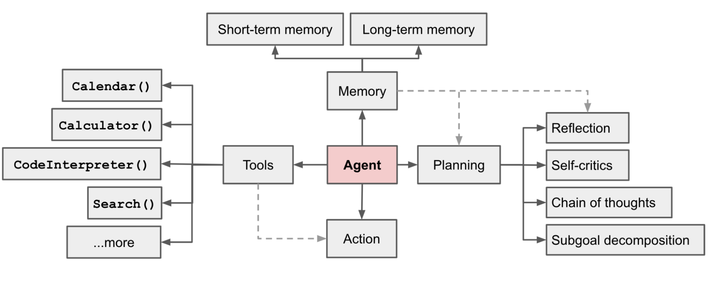

# 协助为 20000+ Star 的开源项目 AutoGen 贡献重要特性: 实现基于 FSM 的群聊

## 引言

### 背景

这一年多以内，LLM 给全世界带来了巨大的震撼，PingCAP 也积极跟进 AI 赋能的应用。我们是 PingCAP 里一个叫 Lab 的小团队，我们致力于开发更好的 AI 应用服务于业务和开发者。之前我们开发了 TiDB Bot，这是一个流程略有些复杂的检索增加生成 (Retrieval-Augmented Generation, RAG) 应用。同时我们开发了一个面向非程序员的基于有向无环图 (Directed Acyclic Graphs, DAG) 的 LLM 应用开发和服务低代码平台(即将开源)。在这一系列的探索过程中，我们意识到有向无环图无法有效地利用循环，牺牲了 LLM 自行纠错的能力。而且另一个主观感受是 DAG + RAG 的进一步潜力挖掘可能人效比会越来越低，我们需要找到一个天花板更高，想象力更丰富的模式来让 LLM 更好地服务于业务，所以开始试图用多智能体的框架来解决更复杂的业务问题。

在众多的多智能体框架中，AutoGen 因为以下优点吸引了我的注意：

1. 概念足够简单
2. Notebook 中的案例非常振奋人心

这和我们之前的设想不谋而合，我们期望用相对统一且简单的范式(利用多个类似于 https://lilianweng.github.io/posts/2023-06-23-agent/ 的智能体)去解决一大类任务。概念简单意味着通用性更强(可能伴随着难以驾驭)，而 Notebook 中漂亮的案例可以侧面证明它的天花板足够高，想象力够大，所以我们决定用 AutoGen 来做一些尝试，评估它能胜任多复杂的真实业务场景。



### 动机

我们在内部有一个数据探索 (Exploratory Data Analysis, EDA) + 根因分析 (Root Cause Analysis, RCA) 的任务计划交给 LLM 来尝试。它涉及到私域知识的理解、NL2SQL、数据统计及分析等多项内容，是一个综合性的表格问答 (Tabular Question Answering, TQA) 任务，如果想在生产上应用，不仅仅是一次成功的实验结果就足够的，可靠性、成本等等都是需要考量的问题。加之 LLM 本身输出就有不确定性，所以任务越复杂，上下文越长，在某个环节出错的概率就越大，SQL 可能写错，业务表也存在变更的可能性，不同时间需要下钻分析的特征是不一样的，而且发布任务的人类也可能没有准确地描述任务，种种原因都会导致中间环节的错误。如果还是使用 DAG 来实现，那它成功的概率就会非常小，或者我们需要用大量的人工来换取成功率的提升。

因此我们尝试用 AutoGen 框架来解决这个问题。在 PingCAP 的实践中，我们认识到，让每一次的 prompt 专注于一件事，而不是把多个需求杂糅在一起。所以针对这个复杂的任务我们引入了 GroupChat，Planner 专注于分解步骤，Engineer 和 Executor 专注于执行 Planner 的任务，Critic 专注于复查结果。

实验结果还是挺喜人的。我们在 100K tokens 的超长上下文中依然以 75% 的成功率稳定输出预期的结果。但想把它用在严肃的生产环境下又不太足够。超长的上下文给优化稳定性和成本都带来了巨大的挑战，几十次重复实验花费了近 400 美金。所以不得不考虑更高性价比的实验思路，即将这个任务需要的能力解耦，用“控制变量法”来尽可能单一地去测试各项子能力。

在之前的实验中，我发现并不是每一次 GroupChat 的发言顺序都和预期的一样，这会导致增加许多无意义且令人迷惑的上下文，对最终效果和成本都不利。所以我考虑单独设计一个考核 GroupChat 控制发言顺序的能力。也就是因此，才有了后面的故事。

## 贡献过程

### 最小实验设计

我设计了如图的任务：各智能体按转移条件依次报数。当前的 GPT-3.5 对于 30 以内的整数能否被 3 或 5 整除已经基本没有问题了。而且这个任务的上下文足够短，所以可以认为除了发言顺序以外，整个任务对于 GPT-4 来说应该是没有任何难点的。


但实验结果非常惊人，GPT-4 或 GPT-4-turbo 竟然都无法按预期地完成这个任务，这是我万万没有想到的。控制发言顺序几乎是 `GroupChatManager` 唯一的工作。这也就意味着它在很多场景下，可能都无法出色有效地完成任务。

如果把每一个智能体看作一个状态，各个智能体按一定的条件依次发言。比如总是 `User` 先发起任务，然后 `Planner` 制定计划。之后是 `Engineer` 和 `Executor` 交替工作，`Critic` 在必要的时候介入，而在 `Critic` 之后只应该是 `Planner` 重新制定额外的计划。每次能且只能处在一个状态，在各状态之前存在转移条件。所以 `GroupChat` 可以很好地被抽象成一个有限状态机。

我注意到 `GroupChat` 类中有一个 `speaker_selection_method` 方法，所以自然而然地想到增加一个叫 `fsm` 的方法，同时的最后供一个 FSM 的描述来让 manager 在它的约束下选择下一位发言者。

```python
fsm = {
    "agents": [engineer, planner, executor, critic, user_proxy],
    "transitions": [
        {"from": user_proxy, "to": planner, "on": None},
        {"from": planner, "to": engineer, "on": None},
        {"from": engineer, "to": executor, "on": "If the last number mentioned by `Engineer` is a multiple of 3, the next speaker can only be `Executor`."},
        {"from": executor, "to": engineer, "on": None},
        {"from": engineer, "to": critic, "on": "If the last number mentioned by `Engineer` is not a multiple of 3, the next speaker can only be `Executor`."},
        {"from": critic, "to": engineer, "on": "If the last number mentioned by the Critic is not a multiple of 5, the next speaker can only be `Planner`."},
        {"from": critic, "to": planner, "on": "If the last number mentioned by the Critic is a multiple of 5, the next speaker can only be `Planner`."},
    ]
}

groupchat = autogen.GroupChat(
    agents=[engineer, planner, executor, critic, user_proxy], messages=[], max_round=25, allow_repeat_speaker=False, finite_state_machine=fsm, speaker_selection_method="fsm"
)
```

按照我自己的设计很快实现了一个 MVP，实验效果和预期一致，重复 20 次得到了 100% 的成功率。

在兴奋地打算提交 Issue 前再检索了一下历史，发现了 [PR #857](https://github.com/microsoft/autogen/pull/857) 试图用图来描述 `GroupChat`，让它可以按既定的顺序发言。这和我的想法有重合之处。

接下来，我又发现已发布的版本中，`ConversableAgent` 有一个 `description` 的参数，它不同于 `system_message`，后者是给自己看的 system prompt，而 `description` 是向别的智能体介绍自己用的。我同样可以把 FSM 里的 `on` 转移条件在 `description` 中去描述。也就是说，我可以将 `description` 和 Graph 结合，达到完整描述 FSM 的目的。在不破坏已有设计(采用 `description`)和高内聚(采用 `on` 条件)中，我决定选择前者。

当我发现 PR #857 同样无法按预期地顺序报数以后，我果然向 repo 提了 Issue*。

> [*] 注：正如我在[这里](https://github.com/microsoft/autogen/issues/1400#issuecomment-1914368471)所说，当时提交 Issue 前忙中出错，我误以为我环境中是 #857 所在分支的最新代码，而其实它的最新代码是可以按我预期状态工作的，所以我要向大家真诚道歉。

### 推进 PR #857 的合并

提出 Issue 之后，社区给了我[很积极的反馈](https://github.com/microsoft/autogen/pull/857#issuecomment-1913909945)。由于[这个契机](https://github.com/microsoft/autogen/pull/857#issuecomment-1911666678)，我开始考虑如何将 FSM 的特性提供给大家。

虽然 PR 原作者提到，转移条件并没有在这个 PR 里考虑到**，但正如前文所说，将 `ConversableAgent` 的 `description` 参数和 PR #857 的图结合起来，即可得到 FSM 同样的效果。为了避免新开 PR 可能引起的新的讨论而浪费时间，我决定在现有的 PR 上继续。

对于现有的 PR，其实我只提出两个改进建议：

1. 如果某一个发言者只有一个 successor，那就不需要 LLM 判断下一位发言者是谁，直接输出这个 successor 作为下一个说话者即可，这样不仅可以增强稳定性，还可以节省 LLM 的花销。
2. 因为 FSM 的下一个状态仅由当前状态及转移条件决定，而与之前的任何一个状态都无关，所以在选择下一个说话者时，只需要保留最后一个说话者及其内容即可，同样可以达到增强稳定性和节省开销的作用。这里增强稳定性的路径和第一点不一样，第一点是地直接规避不必要的 LLM 判断，而第二点是避免过长的上下文对 LLM 输出质量的副作用**。

第一点很容易就被大家接受了，但是第二点 PR 作者和 Repo 所有者均有一定的担忧，认为我的建议过于激进，未被采纳**。

> [**] 注：我会在后文《经验教训》部分总结。 

由于这个 PR 从提出到现在已接近 2 个月时间，反而是上面两个特性增加外的工作对我造成的阻碍更大。第一，这是一个不小的特性，PR 中前前后后的上下文有近千条，而且我也没有参与最初的设计讨论，我需要尽快地补齐所有的信息并理解原有的设计细节。

第二，由于此 PR 许久未合入主干，很多新的特性已上线，它们在设计上和此 PR 难免有冲突，导致在试图将 #857 合入主干时，引发了依赖 `GroupChat` 的另一个特性的单元测试失败。

我仔细看了冲突的特性，它是为 `GroupChat` 提供由外部智能体发起任务的功能。这也是我曾经考虑过的一个重要特性，就像病人就医时，医生可以向另一个团队请求会诊一样，我认为它非常重要。所以我进一步分析了两者的冲突点 [PR #912](https://github.com/microsoft/autogen/pull/912) 因为引入了不在 Graph 中的节点，导致它的 successor 为空，而 PR#857 是希望 graph 中如果有 sink 节点，可以优雅地退出，这两个诉求都是合理的。所以我将无 successor 分为了两类，识别区分它到底是不在图中还是是一个 sink 节点，针对它们采取不同的处理策略，合理兼顾了这两个特性。

经过近一周的接力，在多位贡献者的帮助下，成功将该特性合入主干并在 `0.2.11` 版本中正式提供给用户。

## FSM 特性的应用案例

其实我认为，除了头脑风暴等，在绝大多数应用场景中，FSM 可以被认为是 `GroupChat` 的必备特性。除了现有的 notebook 案例以外，我之前在 Issue 里描述的是另一种使用方法，大家可以认为它是在 `AutoGen` 框架中如何根据 FSM 来组织 `GroupChat` 的示范。

### 用法

1. 导入依赖

    ```python
    from autogen.agentchat import GroupChat, AssistantAgent, UserProxyAgent, GroupChatManager
    from autogen.oai.openai_utils import config_list_from_dotenv
    ```
2. 配置 LLM 参数

    ```python
    # Please feel free to change it as you wish
    config_list = config_list_from_dotenv(
            dotenv_file_path='.env',
            model_api_key_map={'gpt-4-1106-preview':'OPENAI_API_KEY'},
            filter_dict={
                "model": {
                    "gpt-4-1106-preview"
                }
            }
        )

    gpt_config = {
        "cache_seed": None,
        "temperature": 0,
        "config_list": config_list,
        "timeout": 100,
    }
    ```

3. 定义任务

    ```python
    # describe the task
    task = """Add 1 to the number output by the previous role. If the previous number is 20, output "TERMINATE"."""
    ```

4. 定义智能体

    ```python
    # agents configuration
    engineer = AssistantAgent(
        name="Engineer",
        llm_config=gpt_config,
        system_message=task,
        description="""I am **ONLY** allowed to speak **immediately** after `Planner`, `Critic` and `Executor`.
    If the last number mentioned by `Critic` is not a multiple of 5, the next speaker must be `Engineer`.
    """
    )

    planner = AssistantAgent(
        name="Planner",
        system_message=task,
        llm_config=gpt_config,
        description="""I am **ONLY** allowed to speak **immediately** after `User` or `Critic`.
    If the last number mentioned by `Critic` is a multiple of 5, the next speaker must be `Planner`.
    """
    )

    executor = AssistantAgent(
        name="Executor",
        system_message=task,
        is_termination_msg=lambda x: x.get("content", "") and x.get("content", "").rstrip().endswith("FINISH"),
        llm_config=gpt_config,
        description="""I am **ONLY** allowed to speak **immediately** after `Engineer`.
    If the last number mentioned by `Engineer` is a multiple of 3, the next speaker can only be `Executor`.
    """
    )

    critic = AssistantAgent(
        name="Critic",
        system_message=task,
        llm_config=gpt_config,
        description="""I am **ONLY** allowed to speak **immediately** after `Engineer`.
    If the last number mentioned by `Engineer` is not a multiple of 3, the next speaker can only be `Critic`.
    """
    )

    user_proxy = UserProxyAgent(
        name="User",
        system_message=task,
        code_execution_config=False,
        human_input_mode="NEVER",
        llm_config=False,
        description="""
    Never select me as a speaker. 
    """
    )
    ```

    1. 这里，我将 `system_messages` 配置成 "task"，因为每个智能体各自的任务都是一样的，就是依次报数。 
    2. **最重要的是 `description` 参数, 我在这里用自然语言描述一 FSM 的转移条件。因为 manager 可以看到下一位发言者候选们的 `description` 参数，所以它与转移条件的作用是等价的，与传统 FSM 的区别是描述方式为自然语言，决策在 LLM。**

5. 定义图

    ```python
    graph_dict = {}
    graph_dict[user_proxy] = [planner]
    graph_dict[planner] = [engineer]
    graph_dict[engineer] = [critic, executor]
    graph_dict[critic] = [engineer, planner]
    graph_dict[executor] = [engineer]
    ```

    1. **图和上面第 4 点中的转移条件共同组成了一个完整的 FSM，两者缺一不可。**
    2. 如果你想展示下图，可以安装相应依赖并用 AutoGen 自带的可视化函数。

    

6. 定义 `GroupChat` 和 `GroupChatManager`

    ```python
    agents = [user_proxy, engineer, planner, executor, critic]

    # create the groupchat
    group_chat = GroupChat(agents=agents, messages=[], max_round=25, allowed_or_disallowed_speaker_transitions=graph_dict, allow_repeat_speaker=None, speaker_transitions_type="allowed")

    # create the manager
    manager = GroupChatManager(
        groupchat=group_chat, 
        llm_config=gpt_config,
        is_termination_msg=lambda x: x.get("content", "") and x.get("content", "").rstrip().endswith("TERMINATE"),
        code_execution_config=False,
    )
    ```

7. 初始化对话

    ```python
    # initiate the task
    user_proxy.initiate_chat(
        manager,
        message="1",
        clear_history=True
    )
    ```

8. 你会得到以下输出(我删除了不必要的 Warning):

    ```
    User (to chat_manager):

    1

    --------------------------------------------------------------------------------
    Planner (to chat_manager):

    2

    --------------------------------------------------------------------------------
    Engineer (to chat_manager):

    3

    --------------------------------------------------------------------------------
    Executor (to chat_manager):

    4

    --------------------------------------------------------------------------------
    Engineer (to chat_manager):

    5

    --------------------------------------------------------------------------------
    Critic (to chat_manager):

    6

    --------------------------------------------------------------------------------
    Engineer (to chat_manager):

    7

    --------------------------------------------------------------------------------
    Critic (to chat_manager):

    8

    --------------------------------------------------------------------------------
    Engineer (to chat_manager):

    9

    --------------------------------------------------------------------------------
    Executor (to chat_manager):

    10

    --------------------------------------------------------------------------------
    Engineer (to chat_manager):

    11

    --------------------------------------------------------------------------------
    Critic (to chat_manager):

    12

    --------------------------------------------------------------------------------
    Engineer (to chat_manager):

    13

    --------------------------------------------------------------------------------
    Critic (to chat_manager):

    14

    --------------------------------------------------------------------------------
    Engineer (to chat_manager):

    15

    --------------------------------------------------------------------------------
    Executor (to chat_manager):

    16

    --------------------------------------------------------------------------------
    Engineer (to chat_manager):

    17

    --------------------------------------------------------------------------------
    Critic (to chat_manager):

    18

    --------------------------------------------------------------------------------
    Engineer (to chat_manager):

    19

    --------------------------------------------------------------------------------
    Critic (to chat_manager):

    20

    --------------------------------------------------------------------------------
    Planner (to chat_manager):

    TERMINATE
    ```

## 讨论

至此，我们见识到了 FSM 的魔力。希望它能让大家的 `GroupChat` 变得更为可控、可预期。在此，我要感谢所有帮助到我的开发者，感谢大家的提供给我各种信息和建议，感谢 repo 所有者和 PR 作者给我这个合作开发的机会，让这个激动人心的特性得以发布出来。

另外还有一些经验教训和展望可以分享。

### 经验教训

1. 在整个开发过程中，充分的沟通是非常必要的，特别在用非母语的情境下，这一点更为重要。
2. 在我上面用 [**] 标注的地方，事后了我反思一下，确实在我提出 Issue #1400 之前，大家似乎并没有考虑将 `description` 和 graph 相结合的方案，notebook 中的例子虽然激动人心，但确实也不是一个完整的 FSM。所以在原有的设计中，仅选择 `last_speaker` 和它的输出来决定下一个说话者，确实可能存在可靠性风险。而我因为我的建议二不被采纳而困惑，可能是我先入为主地认为大家会把 `description` 和 graph 结合成为一个完整的 FSM 来使用。可能因此产生了 GAP。以上只是我个人角度的反思，如有不对请大家指正。

### 进一步的工作

1. 就像我在《经验教训》中第二条提到的，可以考虑增加一个可选参数，让完整描述 FSM 的 `Groupchat` 可以配置 manager 只需要考虑最后一个发言者，理论上它会有利于准确性和省钱。
2. 在 `AutoGenStudio` 发布之前，我在本地实现了一个几乎一样的后端服务。在 `AutoGenStudio` 出来以后，我果断倾向于拥抱 `AutoGenStudio`。在当时 `AutoGenStuio` 还不支持 `GroupChat`。虽然新的版本支持了，但是对 graph 的序列化和持久化，可能还会存在一些破坏性的变更。两者如何以最小代价结合，也是需要考虑的一个方向。

最后，我要再次感谢在此过程中所有帮助过我的人，包括但不限于 PR #857 的发起者 @joshkyh、`AutoGen` 的发起者 @sonichi、代码评审 @IANTHEREAL、@afourney、@qingyun-wu 等等。这是我第一次为热门开源项目做贡献。这是一次很棒的体验，希望以后可以为 `AutoGen` 提供更多特性。